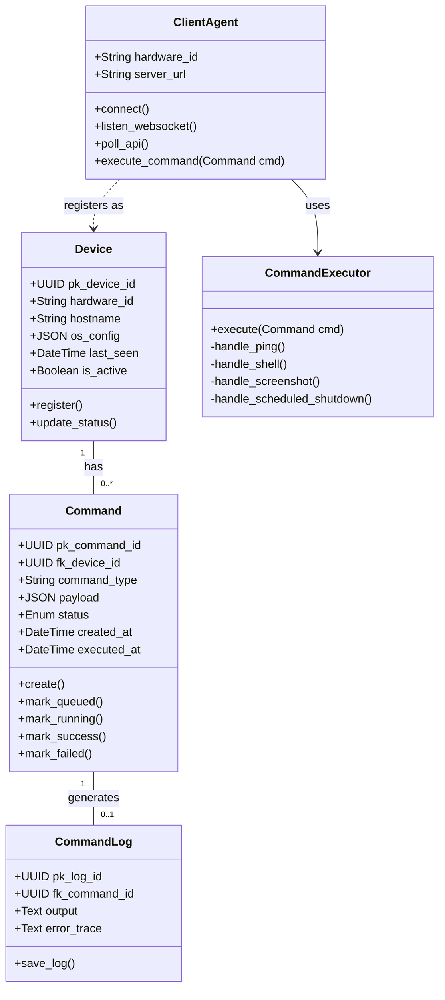

# Class Diagram

```mermaid
classDiagram
    class Device {
        +UUID pk_device_id
        +String hardware_id
        +String hostname
        +JSON os_config
        +DateTime last_seen
        +Boolean is_active
        +register()
        +update_status()
    }

    class Command {
        +UUID pk_command_id
        +UUID fk_device_id
        +String command_type
        +JSON payload
        +Enum status
        +DateTime created_at
        +DateTime executed_at
        +create()
        +mark_queued()
        +mark_running()
        +mark_success()
        +mark_failed()
    }

    class CommandLog {
        +UUID pk_log_id
        +UUID fk_command_id
        +Text output
        +Text error_trace
        +save_log()
    }

    class ClientAgent {
        +String hardware_id
        +String server_url
        +connect()
        +listen_websocket()
        +poll_api()
        +execute_command(Command cmd)
    }

    class CommandExecutor {
        +execute(Command cmd)
        -handle_ping()
        -handle_shell()
        -handle_screenshot()
        -handle_scheduled_shutdown()
    }

    Device "1" -- "0..*" Command : has
    Command "1" -- "0..1" CommandLog : generates
    ClientAgent --> CommandExecutor : uses
    ClientAgent ..> Device : registers as
```
