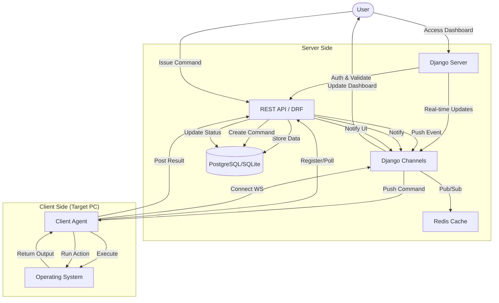

# Project Flow Diagram

```mermaid
graph TD
    User([User]) -->|Access Dashboard| WebApp[Django Server]
    
    subgraph "Server Side"
        WebApp -->|Auth & Validate| API[REST API / DRF]
        WebApp -->|Real-time Updates| WS[Django Channels]
        API -->|Store Data| DB[(PostgreSQL/SQLite)]
        WS -->|Pub/Sub| Redis[Redis Cache]
        API -->|Push Event| WS
    end

    subgraph "Client Side (Target PC)"
        Client[Client Agent] -->|Register/Poll| API
        Client -->|Connect WS| WS
        Client -->|Execute| OS[Operating System]
    end

    User -->|Issue Command| API
    API -->|Create Command| DB
    API -->|Notify| WS
    WS -->|Push Command| Client
    Client -->|Run Action| OS
    OS -->|Return Output| Client
    Client -->|Post Result| API
    API -->|Update Status| DB
    API -->|Notify UI| WS
    WS -->|Update Dashboard| User
```
